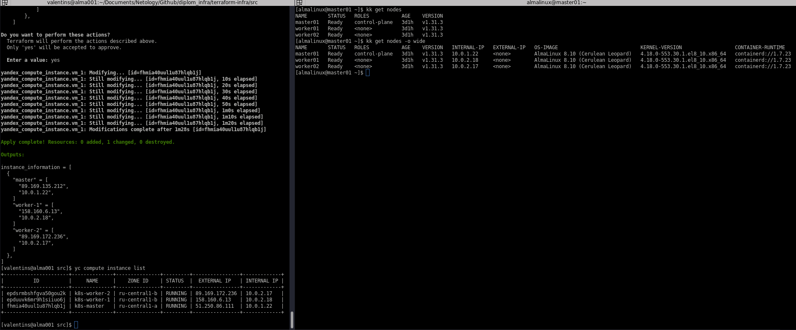
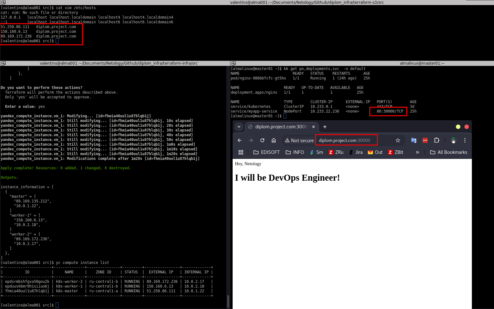
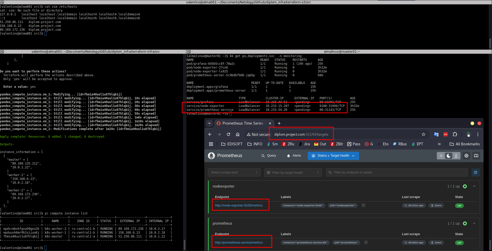
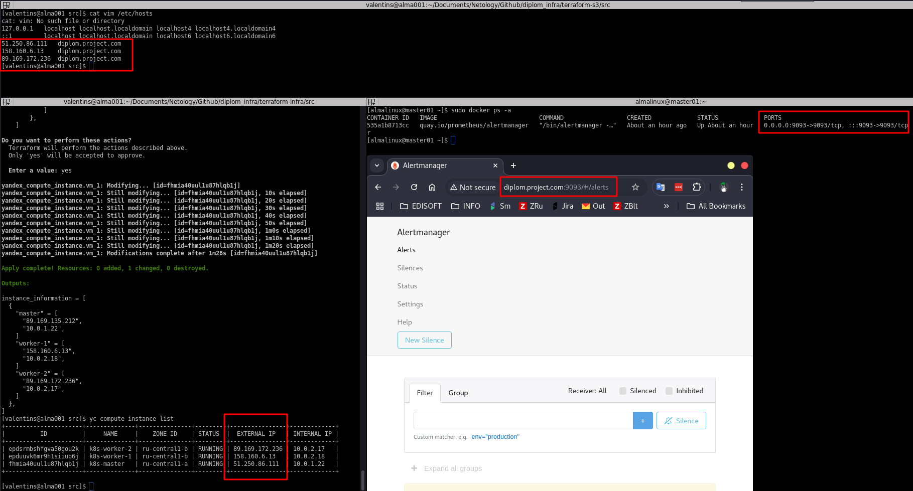
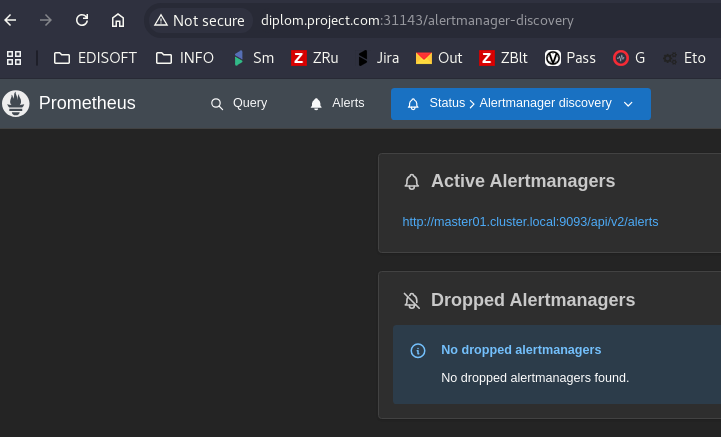
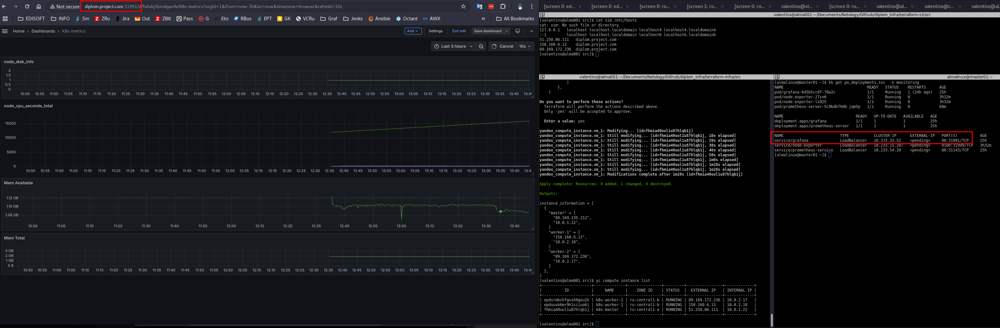

## Deploy k8s cluster for diplom project -- in progress....

[Установка k8s кластера при помощи kubespray](https://github.com/kubernetes-incubator/kubespray.git) / [или](https://sysadmintalks.ru/deploy-kubernetes-cluster-kubespray/)  

Выполнить ряд команд на мастере:

```
git clone https://github.com/kubernetes-incubator/kubespray.git
cd kubespray/
```
 Копируем заготовку инвентори и вносим свои правки:
```
cp -rfp inventory/sample/ inventory/cluster
vim inventory/cluster/inventory.ini
```
Готовый инветори файл в моем случае выглядит так [inventory.ini](./kubespray/inventory/cluster/inventory.ini):
Вставить свой приватный ключ в файл
```
vim ~/.ssh/id_key
chmod 600 ~/.ssh/id_key
```
Установить зависимости:
```
python3.11 -m pip install -r requirements.txt
```
Включить helm/ingress
```
vim inventory/cluster/group_vars/k8s_cluster/addons.yml
```
Запустить плейбук
```
ansible-playbook -i inventory/cluster/inventory.ini cluster.yml -b -v
```
Скопировать конфиг для текущего пользователя
```  
mkdir ~/.kube
sudo cp -i /etc/kubernetes/admin.conf ~/.kube/config
sudo chown `id -u`:`id -g` ~/.kube/config
```
Проверить работу и доступность кластера



```
  kubectl get pods --all-namespaces

[almalinux@master01 ~]$ kk get po --all-namespaces
NAMESPACE     NAME                                       READY   STATUS    RESTARTS        AGE
default       nginx-986bbfcfc-gt5hx                      1/1     Running   1 (25h ago)     26h
kube-system   calico-kube-controllers-55d498b656-dxrfp   1/1     Running   9 (4h38m ago)   3d1h
kube-system   calico-node-5c6d8                          1/1     Running   3 (4h59m ago)   3d1h
kube-system   calico-node-dlv28                          1/1     Running   6 (4h52m ago)   3d1h
kube-system   calico-node-fz9kn                          1/1     Running   7 (4h39m ago)   3d1h
kube-system   coredns-d665d669-2lssb                     1/1     Running   3 (5h ago)      3d1h
kube-system   coredns-d665d669-zvzw9                     1/1     Running   4 (4h39m ago)   3d1h
kube-system   dns-autoscaler-5cb4578f5f-fjjzr            1/1     Running   4 (4h39m ago)   3d1h
kube-system   kube-apiserver-master01                    1/1     Running   6 (4h39m ago)   3d1h
kube-system   kube-controller-manager-master01           1/1     Running   18 (102m ago)   3d1h
kube-system   kube-proxy-5btqc                           1/1     Running   3 (4h59m ago)   3d1h
kube-system   kube-proxy-jptbh                           1/1     Running   4 (4h39m ago)   3d1h
kube-system   kube-proxy-k54nq                           1/1     Running   3 (5h ago)      3d1h
kube-system   kube-scheduler-master01                    1/1     Running   13 (102m ago)   3d1h
kube-system   nginx-proxy-worker01                       1/1     Running   3 (25h ago)     3d1h
kube-system   nginx-proxy-worker02                       1/1     Running   3 (25h ago)     3d1h
kube-system   nodelocaldns-ktz65                         1/1     Running   4 (4h55m ago)   3d1h
kube-system   nodelocaldns-nvbnt                         1/1     Running   4 (4h59m ago)   3d1h
kube-system   nodelocaldns-xfw7t                         1/1     Running   5 (4h37m ago)   3d1h
monitoring    grafana-645b5cc8f-78w2c                    1/1     Running   1 (25h ago)     25h
monitoring    node-exporter-27cn6                        1/1     Running   0               3h53m
monitoring    node-exporter-lx925                        1/1     Running   0               3h53m
monitoring    prometheus-server-5c9bdbf9d6-jqm5p         1/1     Running   0               89m
```
---

## Мониторинг:

 - [My app](./manifest_files/myapp/nginx_deploy.yml)

    

 - [Prometheus](./manifest_files/prometheus/prometheus.yml)

    

 - [Node_export](./manifest_files/node_exporter/node_exporter.yml)
 - Alertmanager:

    ```
    docker run --name alertmanager -d -p 9093:9093 quay.io/prometheus/alertmanager
    [almalinux@master01 ~]$ sudo docker ps -a
    CONTAINER ID   IMAGE                             COMMAND                  CREATED       STATUS       PORTS                                       NAMES
    535a1b8713cc   quay.io/prometheus/alertmanager   "/bin/alertmanager -…"   2 hours ago   Up 2 hours   0.0.0.0:9093->9093/tcp, :::9093->9093/tcp   alertmanager
    ```
    
    

 - Grafana:

    ```
    helm repo add grafana https://grafana.github.io/helm-charts
    helm install grafana grafana/grafana --namespace monitoring
    ```
    [grafana_service](./manifest_files/grafana/service.yml)

    
        
    [Получить логин/пароль от вэба графаны:](https://kubernetes.io/docs/tasks/configmap-secret/managing-secret-using-kubectl/)

>[!NOTE]
>Get your 'admin' user password by running:

```kubectl get secret --namespace monitoring grafana -o jsonpath="{.data.admin-password}" | base64 --decode ; echo```
